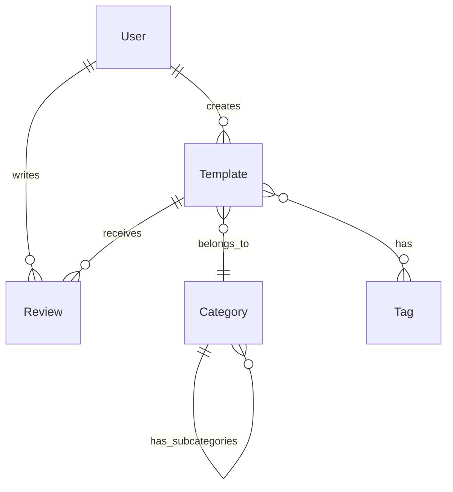

# Templatesia

Plataforma de Templates e IA para desenvolvedores. Desenvolva aplicações com nossa IA especializada em código, compartilhe seus templates com a comunidade e aprenda com outros desenvolvedores.

## Sobre o Projeto

Templatesia é uma plataforma que une IA especializada em código com uma comunidade ativa de desenvolvedores para criar aplicações melhores e mais rápidas. O projeto oferece:

- **Templates**: Acesse centenas de templates verificados e testados pela comunidade
- **Chat IA**: Converse com nossa IA especializada em desenvolvimento de software
- **Community**: Conecte-se com desenvolvedores e receba feedback sobre seus projetos
- **Analytics**: Acompanhe o desempenho e uso dos seus templates compartilhados

## Tecnologias

- **Frontend**: Next.js 14, React, TypeScript, Tailwind CSS
- **Backend**: NestJS, Prisma, MongoDB
- **Autenticação**: NextAuth.js
- **Monorepo**: Turborepo

## Arquivos de Configuração

### .gitignore e .dockerignore

O projeto inclui arquivos de configuração abrangentes para garantir que apenas os arquivos necessários sejam versionados e incluídos nas imagens Docker:

- **`.gitignore`**: Configurado para excluir:
  - Dependências (`node_modules`, etc.)
  - Arquivos de build (`.next/`, `dist/`, etc.)
  - Variáveis de ambiente (`.env`, `.env.*`)
  - Arquivos de cache e logs
  - Arquivos específicos de IDE e sistema operacional
  - Arquivos temporários e de debug

- **`.dockerignore`**: Otimizado para criar imagens Docker mais leves, excluindo:
  - Arquivos de controle de versão (`.git/`, etc.)
  - Arquivos de configuração de desenvolvimento
  - Documentação e arquivos de teste
  - Logs e arquivos temporários

### Variáveis de Ambiente

Um arquivo `.env.example` é fornecido como modelo para configurar as variáveis de ambiente necessárias para o projeto. Para começar:

```bash
cp .env.example .env
```

Edite o arquivo `.env` com suas configurações específicas.

## Design System

### Cores

O Templatesia utiliza uma paleta de cores moderna e acessível:

#### Cores Primárias

- **Azul**: `#3B82F6` (primary-500)
- **Indigo**: `#6366F1` (secondary-500)
- **Roxo**: `#8B5CF6` (accent-500)

#### Gradientes

- **Primário**: `bg-gradient-to-r from-blue-600 to-indigo-700`
- **Secundário**: `bg-gradient-to-r from-indigo-600 to-purple-700`
- **Destaque**: `bg-gradient-to-r from-purple-600 to-pink-600`

#### Cores de Estado

- **Sucesso**: `#10B981` (Verde)
- **Alerta**: `#F59E0B` (Amarelo)
- **Erro**: `#EF4444` (Vermelho)
- **Informação**: `#3B82F6` (Azul)

### Tipografia

#### Fontes

- **Principal**: Inter (sans-serif)
- **Código**: Monospace

#### Tamanhos de Fonte

- Extra pequeno: 0.75rem (12px)
- Pequeno: 0.875rem (14px)
- Base: 1rem (16px)
- Grande: 1.125rem (18px)
- Extra grande: 1.25rem (20px)
- 2XL: 1.5rem (24px)
- 3XL: 1.875rem (30px)
- 4XL: 2.25rem (36px)
- 5XL: 3rem (48px)
- 6XL: 3.75rem (60px)

## Estrutura do Projeto

```
templatesia/
├── apps/
│   ├── api/           # Backend NestJS
│   └── web/           # Frontend Next.js
├── packages/
│   ├── database/      # Prisma schema e client
│   ├── eslint-config/ # Configurações de ESLint
│   ├── tsconfig/      # Configurações de TypeScript
│   └── ui/            # Componentes compartilhados
└── turbo.json         # Configuração do Turborepo
```

## Começando

### Pré-requisitos

- Node.js 18+
- MongoDB
- Yarn ou NPM

### Instalação

1. Clone o repositório

   ```bash
   git clone https://github.com/seu-usuario/templatesia.git
   cd templatesia
   ```

2. Instale as dependências

   ```bash
   npm install
   ```

3. Configure as variáveis de ambiente

   ```bash
   cp .env.example .env
   ```

4. Inicie o servidor de desenvolvimento

   ```bash
   npm run dev
   ```

## Contribuição

Contribuições são bem-vindas! Por favor, leia as diretrizes de contribuição antes de enviar um pull request.

## Licença

Este projeto está licenciado sob a licença MIT - veja o arquivo LICENSE para mais detalhes.

## 📑 Índice

- [Visão Geral](#visão-geral)
- [Funcionalidades](#funcionalidades)
- [Stack Tecnológico](#stack-tecnológico)
- [Começando](#começando)
- [Documentação da API](#documentação-da-api)
- [Planos e Preços](#planos-e-preços)
- [Segurança](#segurança)
- [Roadmap](#roadmap)
- [Contribuindo](#contribuindo)
- [Status do Projeto](#status-do-projeto)
- [Suporte](#suporte)
- [CI/CD e Análise de Código](#ci-cd-e-análise-de-código)
- [Modelagem de Dados](#modelagem-de-dados)
- [Serviços Locais](#serviços-locais)

## 🎯 Visão Geral

Desenvolva aplicações com nossa IA especializada em código, compartilhe seus templates com a comunidade e aprenda com outros desenvolvedores.

### Por que usar Templatesia?

- 🤖 **Chat IA Especializado**: IA treinada para desenvolvimento
- 🌟 **Comunidade Ativa**: Compartilhe e aprenda com outros devs
- 📚 **Biblioteca Colaborativa**: Templates verificados e testados
- 💡 **Desenvolvimento Social**: Interaja, contribua e evolua

## ⚡ Funcionalidades

### Core

- Chat IA para desenvolvimento
- Biblioteca de templates
- Sistema de reviews e avaliações
- Colaboração em tempo real

### Comunidade

- Perfis de desenvolvedores
- Sistema de reputação
- Fóruns por categoria
- Eventos virtuais

### Templates

- Categorias especializadas
- Versionamento
- Preview em tempo real
- Analytics detalhado

## 🛠️ Stack Tecnológico

### Frontend

- Next.js 14 (App Router)
- TypeScript
- Tailwind CSS + Shadcn/ui
- Zustand + React Query

### Backend

- NestJS (Node.js)
- MongoDB + Redis
- Prisma (ORM)
- WebSockets (Socket.io)

### Infraestrutura

- Vercel (Frontend)
- Railway/Render (Backend)
- MongoDB Atlas
- Cloudinary (Mídia)

## 🚀 Começando

1. **Clone o repositório**

```bash
git clone https://github.com/seu-usuario/templatebuilderia.git
cd templatebuilderia
```

2. **Configure o ambiente**

```bash
cp .env.example .env
npm install
```

3. **Inicie os serviços**

```bash
docker-compose up -d
npx turbo run db:generate
```

4. **Inicie o desenvolvimento**

```bash
npm run dev
```

5. Acesse:
   - Frontend: <http://localhost:3000>
   - API: <http://localhost:3001>
   - API Docs: <http://localhost:3001/api/docs>

## 📘 Documentação da API

### Plano Gratuito

```typescript
// Templates Básicos
GET    /api/templates                 // Lista paginada
GET    /api/templates/:id            // Detalhes
GET    /api/templates/search         // Busca simples
POST   /api/templates/:id/like       // Curtir

// Limites:
- 100 requisições/hora
- 5 templates próprios
- Funcionalidades básicas
```

### Plano Pro

```typescript
// Templates Avançados
GET    /api/pro/templates/analytics   // Métricas
POST   /api/pro/templates/import     // Importação
POST   /api/pro/ai/analyze          // Análise IA
GET    /api/pro/analytics/*         // Analytics

// Limites:
- 10.000 requisições/hora
- Templates ilimitados
- Recursos avançados
```

## 💰 Planos e Preços

### Gratuito

- Acesso ao chat IA (3 dias)
- Templates básicos
- Comunidade limitada
- Preço: R$ 0

### Pro (R$ 29/mês)

- Chat IA ilimitado
- Todos os templates
- Acesso total à comunidade
- Suporte prioritário

## 🔒 Segurança

### Autenticação

- Login seguro com OAuth 2.0
- Autenticação em duas etapas (2FA)
- Tokens JWT com rotação automática
- Proteção contra força bruta

### Proteção de Dados

- Criptografia AES-256 para dados sensíveis
- Backups automáticos diários
- Monitoramento 24/7
- Conformidade com LGPD/GDPR

### Boas Práticas

- Sanitização de inputs
- Proteção contra XSS e CSRF
- Rate limiting por IP
- Logs de auditoria

Encontrou uma vulnerabilidade? Por favor, envie um email para <security@templatesia.com>

## 📊 Status do Projeto


### Métricas

- Uptime: 99.9%
- Tempo médio de resposta: <100ms
- Usuários ativos: 1000+
- Templates publicados: 500+

## 💬 Suporte

- 📧 Email: <luissimonazure@gmail.com>
- 💭 Discord: [Junte-se ao nosso servidor](https://discord.gg/templatesia)
- 📚 Documentação: [docs.templatesia.com](https://docs.templatesia.com)
- 🐛 Issues: [GitHub Issues](https://github.com/templatesia/issues)

## 🗺️ Roadmap

### Fase 1 (MVP)

- Sistema de autenticação
- CRUD de templates
- Chat IA básico
- Interações essenciais

### Fase 2

- Preview em tempo real
- Sistema de reviews
- Colaboração avançada
- Analytics básico

### Fase 3

- Marketplace
- Integrações (GitHub, VSCode)
- Sistema de mentoria
- Analytics avançado

## 🤝 Contribuindo

1. Fork o projeto
2. Crie sua branch (`git checkout -b feature/AmazingFeature`)
3. Commit suas mudanças (`git commit -m 'Add: nova feature'`)
4. Push para a branch (`git push origin feature/AmazingFeature`)
5. Abra um Pull Request

## 📄 Licença

Este projeto está sob a licença MIT. Veja o arquivo [LICENSE](LICENSE) para mais detalhes.

## 📄 CI/CD e Análise de Código

### Execução Manual de Workflows

Todos os workflows podem ser executados manualmente através da interface do GitHub Actions ou através de tags nos commits.

#### Executando via Interface

1. Acesse a aba "Actions" no GitHub
2. Selecione o workflow desejado
3. Clique em "Run workflow"
4. Selecione as opções desejadas
5. Clique em "Run workflow"

#### Executando via Tags

Para executar workflows específicos, adicione uma das seguintes tags ao seu commit:

```bash
# Análise de Qualidade
git tag quality-v1.0
git push origin quality-v1.0

# Análise de Segurança
git tag security-v1.0
git push origin security-v1.0

# Testes
git tag test-v1.0
git push origin test-v1.0

# Análise de Performance
git tag perf-v1.0
git push origin perf-v1.0

# Release (executa todos os workflows)
git tag release-v1.0
git push origin release-v1.0
```

Exemplo de uso com mensagem:

```bash
# Criar commit
git commit -m "feat: nova funcionalidade"

# Adicionar tag
git tag -a quality-v1.0 -m "Análise de qualidade para feature X"
git push origin quality-v1.0
```

### Workflows Disponíveis

#### 1. Análise de Qualidade (code-quality.yml)

- **Ferramenta Principal**: SonarCloud
- **Quando Executa**: Em pushes e PRs para `main`
- **Funcionalidades**:
  - Análise de qualidade do código
  - Detecção de code smells e duplicações
  - Monitoramento de cobertura de testes
  - Métricas de complexidade ciclomática

```yaml
# Configuração do SonarCloud necessária:
sonar.organization=luissimon96
sonar.projectKey=templatesia
sonar.javascript.lcov.reportPaths=coverage/lcov.info
```

#### 2. Análise de Segurança (security.yml)

- **Ferramentas**:
  - OWASP Dependency Check
  - Snyk
  - CodeQL
- **Quando Executa**:
  - Em pushes e PRs para `main`
  - Automaticamente todo domingo à meia-noite
- **Verificações**:
  - Vulnerabilidades em dependências
  - Análise estática de segurança
  - Problemas de segurança no código
  - Geração de relatórios SARIF

#### 3. Lint e Testes (lint-test.yml)

- **Ferramentas**:
  - ESLint
  - TypeScript
  - Jest
  - Playwright
- **Verificações**:
  - Padrões de código
  - Type checking
  - Testes unitários
  - Testes E2E
  - Formatação de código

#### 4. Análise de Performance (performance.yml)

- **Ferramentas**:
  - Lighthouse CI
  - Next.js Bundle Analyzer
- **Quando Executa**:
  - Em pushes e PRs para `main`
  - Toda segunda-feira à meia-noite
- **Métricas**:
  - Performance web
  - Acessibilidade
  - SEO
  - Análise de bundle size

### Opções de Execução Manual

#### 1. Análise de Qualidade (code-quality.yml)

- **Ambientes**: development, staging, production
- **Comando**:

  ```bash
  git tag quality-{versão}
  ```

#### 2. Análise de Segurança (security.yml)

- **Tipos de Scan**: full, dependencies, code
- **Comando**:

  ```bash
  git tag security-{versão}
  ```

#### 3. Lint e Testes (lint-test.yml)

- **Escopos**: full, unit, e2e, lint
- **Comando**:

  ```bash
  git tag test-{versão}
  ```

#### 4. Análise de Performance (performance.yml)

- **Tipos**: full, lighthouse, bundle
- **Comando**:

  ```bash
  git tag perf-{versão}
  ```

### Boas Práticas de Versionamento

1. **Formato de Tags**:
   - Use versionamento semântico: `tipo-vX.Y.Z`
   - X: Versão maior (breaking changes)
   - Y: Versão menor (novas features)
   - Z: Patches (correções)

2. **Tags de Release**:
   - Use `release-vX.Y.Z` para releases completos
   - Executa automaticamente todos os workflows
   - Exemplo: `release-v1.0.0`

3. **Tags de Análise**:
   - Use prefixos específicos: quality-, security-, test-, perf-
   - Adicione o número da versão: v1.0.0
   - Exemplo: `quality-v1.0.0`

### Configuração de Tokens e Secrets

Para que os workflows funcionem corretamente, você precisa configurar os seguintes tokens no GitHub:

#### 1. Tokens Necessários

| Token | Descrição | Onde Obter |
|-------|-----------|------------|
| `GITHUB_TOKEN` | Automático | Fornecido automaticamente pelo GitHub |
| `SONAR_TOKEN` | Token do SonarCloud | [SonarCloud Account](https://sonarcloud.io/account/security) |
| `SNYK_TOKEN` | Token do Snyk | [Snyk Account Settings](https://app.snyk.io/account) |

#### 2. Como Configurar

1. **No GitHub**:

   ```bash
   1. Acesse seu repositório
   2. Vá para Settings > Secrets and variables > Actions
   3. Clique em "New repository secret"
   4. Adicione cada token necessário
   ```

2. **Obtendo os Tokens**:

   a) **SONAR_TOKEN**:

   ```bash
   1. Crie uma conta no SonarCloud
   2. Vincule seu repositório GitHub
   3. Vá em Account > Security
   4. Gere um novo token
   ```

   b) **SNYK_TOKEN**:

   ```bash
   1. Crie uma conta no Snyk
   2. Vá em Account Settings
   3. Localize "Auth Token"
   4. Copie o token existente ou gere um novo
   ```

#### 3. Verificação da Configuração

Para verificar se os tokens estão configurados corretamente:

1. **SonarCloud**:

```bash
# Execute a análise de qualidade
git tag quality-test
git push origin quality-test
```

2. **Snyk**:

```bash
# Execute a análise de segurança
git tag security-test
git push origin security-test
```

#### 4. Troubleshooting

Se encontrar erros relacionados a tokens:

1. **Erro de Autenticação**:
   - Verifique se o token está correto
   - Confirme se o nome do secret está exato
   - Verifique as permissões do token

2. **Token Expirado**:
   - Gere um novo token
   - Atualize o secret no GitHub
   - Execute o workflow novamente

3. **Permissões Insuficientes**:
   - Verifique as permissões do token
   - Confirme se a organização tem acesso
   - Verifique as permissões do repositório

## 📊 Modelagem de Dados

### Entidades Principais

#### 1. User

```typescript
interface User {
  id: string;                    // ID único do usuário
  email: string;                 // Email único
  name: string;                  // Nome completo
  username: string;              // Nome de usuário único
  password: string;              // Senha criptografada
  avatar?: string;               // URL do avatar
  bio?: string;                  // Biografia
  role: 'USER' | 'PRO' | 'ADMIN';// Nível de acesso
  reputation: number;            // Pontuação de reputação
  githubId?: string;            // ID do GitHub (OAuth)
  createdAt: Date;              // Data de criação
  updatedAt: Date;              // Data de atualização
  lastLogin: Date;              // Último login
  isVerified: boolean;          // Email verificado
  is2FAEnabled: boolean;        // 2FA ativado
  preferences: UserPreferences; // Preferências do usuário
}

interface UserPreferences {
  emailNotifications: boolean;
  theme: 'light' | 'dark' | 'system';
  language: string;
  displayEmail: boolean;
}
```

#### 2. Template

```typescript
interface Template {
  id: string;                   // ID único do template
  title: string;                // Título
  description: string;          // Descrição
  content: string;              // Conteúdo do template
  version: string;              // Versão atual
  author: User;                 // Autor
  category: Category;           // Categoria
  tags: Tag[];                 // Tags
  framework: string;           // Framework utilizado
  language: string;            // Linguagem principal
  dependencies: Dependency[];  // Dependências
  likes: number;               // Número de likes
  downloads: number;           // Número de downloads
  rating: number;              // Média das avaliações
  isPublic: boolean;           // Visibilidade
  isVerified: boolean;         // Verificado pela equipe
  createdAt: Date;             // Data de criação
  updatedAt: Date;             // Data de atualização
  pricing: 'FREE' | 'PRO';     // Tipo de acesso
}

interface Dependency {
  name: string;
  version: string;
  isRequired: boolean;
}
```

#### 3. Review

```typescript
interface Review {
  id: string;                  // ID único da review
  template: Template;          // Template avaliado
  author: User;                // Autor da review
  rating: number;              // Nota (1-5)
  comment: string;             // Comentário
  likes: number;               // Likes na review
  isVerified: boolean;         // Review verificada
  createdAt: Date;             // Data de criação
  updatedAt: Date;             // Data de atualização
}
```

#### 4. Category

```typescript
interface Category {
  id: string;                  // ID único da categoria
  name: string;                // Nome
  description: string;         // Descrição
  slug: string;                // URL amigável
  icon: string;                // Ícone
  parentId?: string;           // Categoria pai (subcategorias)
  templates: Template[];       // Templates na categoria
  isActive: boolean;           // Status
}
```

#### 5. Tag

```typescript
interface Tag {
  id: string;                  // ID único da tag
  name: string;                // Nome
  slug: string;                // URL amigável
  count: number;               // Número de usos
  templates: Template[];       // Templates com a tag
}
```

### Relacionamentos



### Índices MongoDB

```javascript
// Users Collection
db.users.createIndex({ "email": 1 }, { unique: true })
db.users.createIndex({ "username": 1 }, { unique: true })
db.users.createIndex({ "githubId": 1 })

// Templates Collection
db.templates.createIndex({ "title": "text", "description": "text" })
db.templates.createIndex({ "author": 1 })
db.templates.createIndex({ "category": 1 })
db.templates.createIndex({ "tags": 1 })
db.templates.createIndex({ "pricing": 1 })
db.templates.createIndex({ "isPublic": 1 })

// Reviews Collection
db.reviews.createIndex({ "template": 1 })
db.reviews.createIndex({ "author": 1 })

// Categories Collection
db.categories.createIndex({ "slug": 1 }, { unique: true })
db.categories.createIndex({ "parentId": 1 })

// Tags Collection
db.tags.createIndex({ "slug": 1 }, { unique: true })
db.tags.createIndex({ "name": "text" })
```

### Validações MongoDB

```javascript
// Exemplo de schema validation para Templates
db.createCollection("templates", {
  validator: {
    $jsonSchema: {
      bsonType: "object",
      required: ["title", "description", "content", "author", "category"],
      properties: {
        title: {
          bsonType: "string",
          minLength: 3,
          maxLength: 100
        },
        description: {
          bsonType: "string",
          maxLength: 500
        },
        rating: {
          bsonType: "number",
          minimum: 0,
          maximum: 5
        }
      }
    }
  }
})
```

### Cache Strategy

```typescript
// Configuração Redis
interface CacheConfig {
  // Templates populares (1 hora)
  'popular-templates': {
    ttl: 3600,
    keys: ['category', 'page', 'limit']
  },
  // Detalhes do template (15 minutos)
  'template-details': {
    ttl: 900,
    keys: ['templateId']
  },
  // Contadores (1 minuto)
  'template-counters': {
    ttl: 60,
    keys: ['templateId', 'type']
  }
}
```

### Migrations

Manteremos um controle de versão do banco de dados usando migrations:

```bash
migrations/
├── 20240316000000-initial-schema.js
├── 20240316000001-add-user-preferences.js
├── 20240316000002-add-template-pricing.js
└── 20240316000003-add-review-verification.js
```

### Backup Strategy

1. **Backup Completo**: Diário (00:00 UTC)
2. **Backup Incremental**: A cada 6 horas
3. **Retenção**:
   - Diários: 7 dias
   - Semanais: 4 semanas
   - Mensais: 12 meses

### Monitoramento

Métricas principais a serem monitoradas:

1. **Performance**:
   - Tempo médio de query
   - Índices mais utilizados
   - Tamanho das coleções

2. **Operacional**:
   - Número de conexões
   - Taxa de cache hit/miss
   - Uso de memória

3. **Negócio**:
   - Templates criados/dia
   - Reviews/dia
   - Taxa de conversão free/pro

## 🔧 Serviços Locais

O projeto inclui serviços locais alternativos para desenvolvimento, eliminando a necessidade de serviços pagos:

### Serviços Disponíveis

| Serviço | Descrição | URL Local | Alternativa Para |
|---------|-----------|-----------|------------------|
| MinIO | Armazenamento de objetos | <http://localhost:9011> | Cloudinary |
| Graylog | Gerenciamento de logs | <http://localhost:9100> | Sentry |
| Redis | Cache e filas | localhost:6379 | Redis Cloud |

### Configuração dos Serviços

#### MinIO (Alternativa ao Cloudinary)

- **Interface Admin**: <http://localhost:9011>
- **Endpoint S3**: <http://localhost:9010>
- **Credenciais**:
  - Usuário: `templatesia`
  - Senha: `templatesia123`
- **Configuração**:
  1. Acesse a interface web
  2. Crie um bucket chamado `templatesia`
  3. Configure as permissões para acesso público

#### SonarCloud (Análise de Qualidade de Código)

- **Interface**: <https://sonarcloud.io>
- **Configuração**:
  1. Crie uma conta no SonarCloud
  2. Configure a integração com o GitHub
  3. Gere um token de acesso
  4. Atualize o `SONAR_TOKEN` no arquivo `.env`

#### Graylog (Alternativa ao Sentry)

- **Interface**: <http://localhost:9100>
- **Credenciais Padrão**:
  - Usuário: `admin`
  - Senha: `admin`
- **Configuração**:
  1. Configure um input GELF UDP na porta 12201
  2. Crie um stream para capturar os logs da aplicação
  3. Gere um token de API
  4. Atualize o `GRAYLOG_TOKEN` no arquivo `.env`

### Uso no Código

```typescript
// Exemplo de uso do MinIO (em vez do Cloudinary)
import { S3Client } from '@aws-sdk/client-s3';

const s3Client = new S3Client({
  endpoint: process.env.MINIO_ENDPOINT,
  credentials: {
    accessKeyId: process.env.MINIO_ACCESS_KEY!,
    secretAccessKey: process.env.MINIO_SECRET_KEY!,
  },
  forcePathStyle: true, // Necessário para MinIO
});

// Exemplo de uso do Graylog (em vez do Sentry)
import { graylog2 } from 'graylog2';

const graylog = new graylog2.Client({
  servers: [process.env.GRAYLOG_URL!],
  token: process.env.GRAYLOG_TOKEN
});
```
