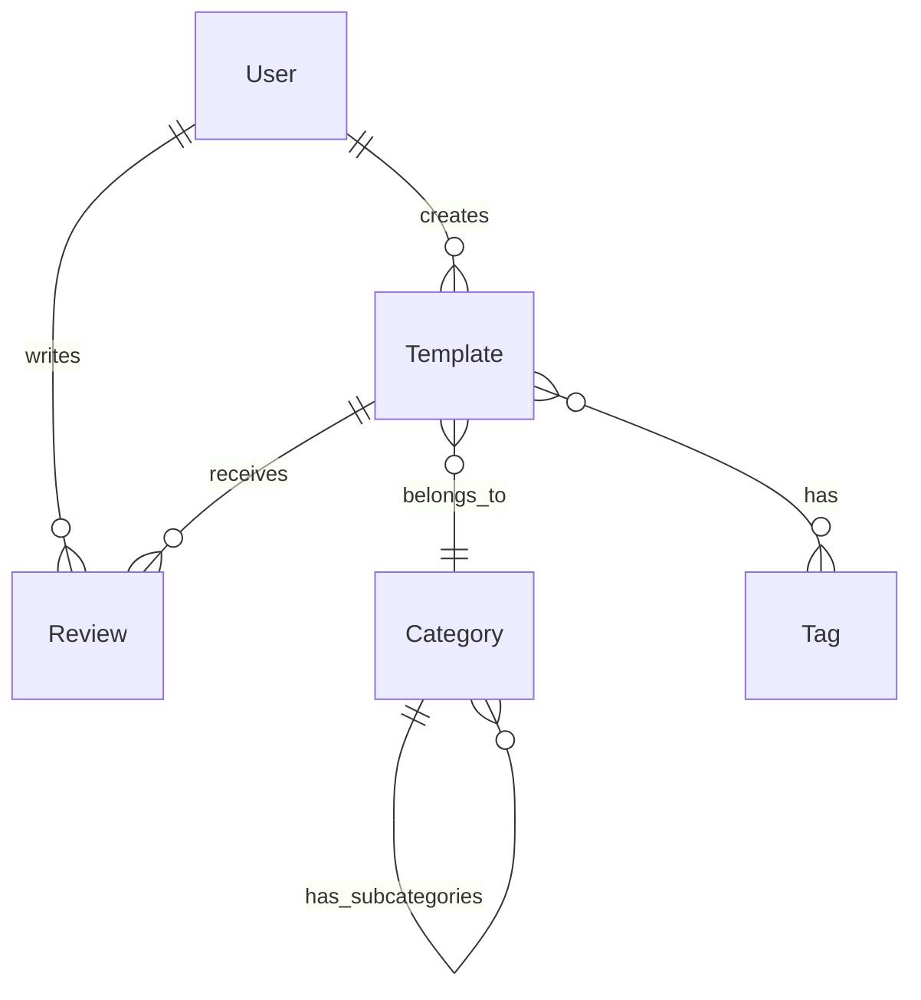

# Templatesia

Plataforma de Templates e IA para desenvolvedores. Desenvolva aplicações com nossa IA especializada em código, compartilhe seus templates com a comunidade e aprenda com outros desenvolvedores.

## Sobre o Projeto

Templatesia é uma plataforma que une IA especializada em código com uma comunidade ativa de desenvolvedores para criar aplicações melhores e mais rápidas. O projeto oferece:

- **Templates**: Acesse centenas de templates verificados e testados pela comunidade
- **Chat IA**: Converse com nossa IA especializada em desenvolvimento de software
- **Community**: Conecte-se com desenvolvedores e receba feedback sobre seus projetos
- **Analytics**: Acompanhe o desempenho e uso dos seus templates compartilhados

## Tecnologias

### Frontend
- **Framework**: Next.js 14 (App Router)
- **Linguagem**: TypeScript
- **Estilização**: Tailwind CSS + Shadcn/ui
- **Gerenciamento de Estado**: Zustand, React Query
- **Autenticação**: NextAuth.js

### Backend
- **Framework**: NestJS 10
- **Linguagem**: TypeScript
- **Banco de Dados**: MongoDB
- **Cache**: Redis
- **Autenticação**: JWT, Passport
- **Documentação**: Swagger/OpenAPI
- **Validação**: class-validator, class-transformer

### Infraestrutura
- **Monorepo**: Turborepo
- **Gerenciamento de Dependências**: npm
- **Variáveis de Ambiente**: dotenv
- **Builds**: Webpack

## Arquitetura do Projeto

```
templatesia/
├── apps/
│   ├── api/           # Backend NestJS
│   └── web/           # Frontend Next.js
├── packages/
│   ├── database/      # Prisma schema e client
│   ├── eslint-config/ # Configurações de ESLint
│   ├── tsconfig/      # Configurações de TypeScript
│   └── ui/            # Componentes compartilhados
└── turbo.json         # Configuração do Turborepo
```

## Começando

### Pré-requisitos

- Node.js 18+
- MongoDB
- Redis (opcional para cache)
- npm ou yarn

### Instalação

1. Clone o repositório

   ```bash
   git clone https://github.com/seu-usuario/templatesia.git
   cd templatesia
   ```

2. Instale as dependências

   ```bash
   npm install
   ```

3. Configure as variáveis de ambiente (já existe um arquivo .env na raiz do projeto)

   ```bash
   # Verifique o arquivo .env e ajuste conforme necessário
   ```

4. Inicialize o servidor API

   ```bash
   # Método simplificado (na raiz do projeto)
   npm run api
   
   # OU individualmente
   npm run api:build
   npm run api:start
   ```

   O servidor API estará disponível em http://localhost:3000/api
   A documentação Swagger estará disponível em http://localhost:3000/api/docs

5. Inicialize o frontend

   ```bash
   # Em outro terminal, na pasta raiz do projeto
   npm run web
   ```

   A aplicação web estará disponível em http://localhost:3000

### Scripts Disponíveis

#### Projeto Raiz
```bash
npm run dev        # Executa todos os projetos em modo de desenvolvimento
npm run build      # Compila todos os projetos
npm run lint       # Executa linting em todos os projetos
npm run api        # Compila e inicia a API usando o arquivo .env da raiz
npm run api:build  # Apenas compila a API
npm run api:start  # Apenas inicia a API usando o arquivo .env da raiz
npm run web        # Inicia o frontend
```

#### API (apps/api)
```bash
npm run build              # Compila o projeto
npm run dev                # Inicia o servidor em modo de desenvolvimento
npm run dev:clean          # Limpa cache e inicia o servidor
npm run dev:fresh          # Remove diretórios de build e inicia o servidor
npm run dev:root-env       # Inicia o servidor usando o arquivo .env da raiz
```

#### Web (apps/web)
```bash
npm run dev        # Inicia o servidor Next.js em modo de desenvolvimento
npm run build      # Compila o projeto para produção
npm run start      # Inicia o servidor compilado
```

## Variáveis de Ambiente

O arquivo `.env` na raiz do projeto contém todas as configurações necessárias:

```bash
# Ambiente
NODE_ENV=development

# API
API_PORT=3000
API_URL=http://localhost:3000
CORS_ORIGIN=http://localhost:3000

# MongoDB
MONGO_URI=mongodb://localhost:27017/templatesia

# JWT
JWT_SECRET=seu_segredo_aqui
JWT_EXPIRATION=7d

# Frontend
NEXT_PUBLIC_API_URL=http://localhost:3000

# NextAuth
NEXTAUTH_URL=http://localhost:3000
NEXTAUTH_SECRET=seu_segredo_aqui
```

## Configurações Específicas

### NestJS (Backend)
- **Swagger**: Disponível em `/api/docs`
- **Rotas API**: Todas as rotas usam o prefixo `/api`
- **Autenticação**: JWT com Passport
- **Validação**: Usa class-validator para DTOs

### Next.js (Frontend)
- **Rotas**: Utiliza o App Router do Next.js 14
- **Autenticação**: NextAuth.js integrado
- **Componentes**: Utiliza Shadcn/ui com Tailwind

## Solução de Problemas (Troubleshooting)

### Problemas Comuns e Soluções

#### 1. Erro "LRU is not a constructor"
- **Problema**: Incompatibilidade com a dependência `lru-cache` usada pelo pacote `semver`.
- **Solução**: Instale a versão 6.0.0 do `lru-cache`:
  ```bash
  cd apps/api
  npm install lru-cache@6.0.0 --save-dev
  ```

#### 2. Variáveis de ambiente não carregadas corretamente
- **Problema**: Múltiplos arquivos `.env` causando conflitos.
- **Solução**: Use apenas o arquivo `.env` na raiz e carregue-o explicitamente na API:
  ```bash
  # Remova outros arquivos .env em subdiretórios
  cd apps/api
  npm run dev:root-env  # Script que carrega o .env da raiz
  ```

#### 3. Conflito de portas entre API e frontend
- **Problema**: Tanto a API quanto o frontend tentam usar a mesma porta.
- **Solução**: Configure a API para usar uma porta específica (3000) no arquivo `.env`.

#### 4. API não inicializa com o comando padrão
- **Problema**: Comando `npm run dev` na raiz não carrega as variáveis de ambiente corretamente.
- **Solução**: Use scripts especializados que foram adicionados ao `package.json` da raiz:
  ```bash
  npm run api  # Compila e inicia a API com configuração correta
  ```

#### 5. Remoção de dependências não utilizadas
- **Problema**: Referências a ferramentas não utilizadas no projeto (como Snyk).
- **Solução**: As referências ao Snyk foram removidas do README. Os workflows do GitHub mencionados no README são mantidos para documentação, mas localmente não há dependência do Snyk instalada.

## Contribuição

Contribuições são bem-vindas! Por favor, leia as diretrizes de contribuição antes de enviar um pull request.

## Licença

Este projeto está licenciado sob a licença MIT - veja o arquivo LICENSE para mais detalhes.

## Suporte

- 📧 Email: <luissimonazure@gmail.com>
- 💭 Discord: [Junte-se ao nosso servidor](https://discord.gg/templatesia)
- 📚 Documentação: [docs.templatesia.com](https://docs.templatesia.com)
- 🐛 Issues: [GitHub Issues](https://github.com/templatesia/issues)

## 📑 Índice

- [Visão Geral](#visão-geral)
- [Funcionalidades](#funcionalidades)
- [Stack Tecnológico](#stack-tecnológico)
- [Começando](#começando)
- [Documentação da API](#documentação-da-api)
- [Planos e Preços](#planos-e-preços)
- [Segurança](#segurança)
- [Roadmap](#roadmap)
- [Contribuindo](#contribuindo)
- [Status do Projeto](#status-do-projeto)
- [Suporte](#suporte)
- [CI/CD e Análise de Código](#ci-cd-e-análise-de-código)
- [Modelagem de Dados](#modelagem-de-dados)
- [Serviços Locais](#serviços-locais)

## 🎯 Visão Geral

Desenvolva aplicações com nossa IA especializada em código, compartilhe seus templates com a comunidade e aprenda com outros desenvolvedores.

### Por que usar Templatesia?

- 🤖 **Chat IA Especializado**: IA treinada para desenvolvimento
- 🌟 **Comunidade Ativa**: Compartilhe e aprenda com outros devs
- 📚 **Biblioteca Colaborativa**: Templates verificados e testados
- 💡 **Desenvolvimento Social**: Interaja, contribua e evolua

## ⚡ Funcionalidades

### Core

- Chat IA para desenvolvimento
- Biblioteca de templates
- Sistema de reviews e avaliações
- Colaboração em tempo real

### Comunidade

- Perfis de desenvolvedores
- Sistema de reputação
- Fóruns por categoria
- Eventos virtuais

### Templates

- Categorias especializadas
- Versionamento
- Preview em tempo real
- Analytics detalhado

## 🛠️ Stack Tecnológico

### Frontend

- Next.js 14 (App Router)
- TypeScript
- Tailwind CSS + Shadcn/ui
- Zustand + React Query

### Backend

- NestJS (Node.js)
- MongoDB + Redis
- Prisma (ORM)
- WebSockets (Socket.io)

### Infraestrutura

- Vercel (Frontend)
- Railway/Render (Backend)
- MongoDB Atlas
- Cloudinary (Mídia)

## 🚀 Começando

1. **Clone o repositório**

```bash
git clone https://github.com/seu-usuario/templatebuilderia.git
cd templatebuilderia
```

2. **Configure o ambiente**

```bash
cp .env.example .env
npm install
```

3. **Inicie os serviços**

```bash
docker-compose up -d
npx turbo run db:generate
```

4. **Inicie o desenvolvimento**

```bash
npm run dev
```

5. Acesse:
   - Frontend: <http://localhost:3000>
   - API: <http://localhost:3001>
   - API Docs: <http://localhost:3001/api/docs>

## 📘 Documentação da API

### Plano Gratuito

```typescript
// Templates Básicos
GET    /api/templates                 // Lista paginada
GET    /api/templates/:id            // Detalhes
GET    /api/templates/search         // Busca simples
POST   /api/templates/:id/like       // Curtir

// Limites:
- 100 requisições/hora
- 5 templates próprios
- Funcionalidades básicas
```

### Plano Pro

```typescript
// Templates Avançados
GET    /api/pro/templates/analytics   // Métricas
POST   /api/pro/templates/import     // Importação
POST   /api/pro/ai/analyze          // Análise IA
GET    /api/pro/analytics/*         // Analytics

// Limites:
- 10.000 requisições/hora
- Templates ilimitados
- Recursos avançados
```

## 💰 Planos e Preços

### Gratuito

- Acesso ao chat IA (3 dias)
- Templates básicos
- Comunidade limitada
- Preço: R$ 0

### Pro (R$ 29/mês)

- Chat IA ilimitado
- Todos os templates
- Acesso total à comunidade
- Suporte prioritário

## 🔒 Segurança

### Autenticação

- Login seguro com OAuth 2.0
- Autenticação em duas etapas (2FA)
- Tokens JWT com rotação automática
- Proteção contra força bruta

### Proteção de Dados

- Criptografia AES-256 para dados sensíveis
- Backups automáticos diários
- Monitoramento 24/7
- Conformidade com LGPD/GDPR

### Boas Práticas

- Sanitização de inputs
- Proteção contra XSS e CSRF
- Rate limiting por IP
- Logs de auditoria

Encontrou uma vulnerabilidade? Por favor, envie um email para <security@templatesia.com>

## 📊 Status do Projeto


### Métricas

- Uptime: 99.9%
- Tempo médio de resposta: <100ms
- Usuários ativos: 1000+
- Templates publicados: 500+

## 💬 Suporte

- 📧 Email: <luissimonazure@gmail.com>
- 💭 Discord: [Junte-se ao nosso servidor](https://discord.gg/templatesia)
- 📚 Documentação: [docs.templatesia.com](https://docs.templatesia.com)
- 🐛 Issues: [GitHub Issues](https://github.com/templatesia/issues)

## 🗺️ Roadmap

### Fase 1 (MVP)

- Sistema de autenticação
- CRUD de templates
- Chat IA básico
- Interações essenciais

### Fase 2

- Preview em tempo real
- Sistema de reviews
- Colaboração avançada
- Analytics básico

### Fase 3

- Marketplace
- Integrações (GitHub, VSCode)
- Sistema de mentoria
- Analytics avançado

## 🤝 Contribuindo

1. Fork o projeto
2. Crie sua branch (`git checkout -b feature/AmazingFeature`)
3. Commit suas mudanças (`git commit -m 'Add: nova feature'`)
4. Push para a branch (`git push origin feature/AmazingFeature`)
5. Abra um Pull Request

## 📄 Licença

Este projeto está sob a licença MIT. Veja o arquivo [LICENSE](LICENSE) para mais detalhes.

## 📄 CI/CD e Análise de Código

### Execução Manual de Workflows

Todos os workflows podem ser executados manualmente através da interface do GitHub Actions ou através de tags nos commits.

#### Executando via Interface

1. Acesse a aba "Actions" no GitHub
2. Selecione o workflow desejado
3. Clique em "Run workflow"
4. Selecione as opções desejadas
5. Clique em "Run workflow"

#### Executando via Tags

Para executar workflows específicos, adicione uma das seguintes tags ao seu commit:

```bash
# Análise de Qualidade
git tag quality-v1.0
git push origin quality-v1.0

# Análise de Segurança
git tag security-v1.0
git push origin security-v1.0

# Testes
git tag test-v1.0
git push origin test-v1.0

# Análise de Performance
git tag perf-v1.0
git push origin perf-v1.0

# Release (executa todos os workflows)
git tag release-v1.0
git push origin release-v1.0
```

Exemplo de uso com mensagem:

```bash
# Criar commit
git commit -m "feat: nova funcionalidade"

# Adicionar tag
git tag -a quality-v1.0 -m "Análise de qualidade para feature X"
git push origin quality-v1.0
```

### Workflows Disponíveis

#### 1. Análise de Qualidade (code-quality.yml)

- **Ferramenta Principal**: SonarCloud
- **Quando Executa**: Em pushes e PRs para `main`
- **Funcionalidades**:
  - Análise de qualidade do código
  - Detecção de code smells e duplicações
  - Monitoramento de cobertura de testes
  - Métricas de complexidade ciclomática

```yaml
# Configuração do SonarCloud necessária:
sonar.organization=luissimon96
sonar.projectKey=templatesia
sonar.javascript.lcov.reportPaths=coverage/lcov.info
```

#### 2. Análise de Segurança (security.yml)

- **Ferramentas**:
  - OWASP Dependency Check
  - CodeQL
- **Quando Executa**:
  - Em pushes e PRs para `main`
  - Automaticamente todo domingo à meia-noite
- **Verificações**:
  - Vulnerabilidades em dependências
  - Análise estática de segurança
  - Problemas de segurança no código
  - Geração de relatórios SARIF

#### 3. Lint e Testes (lint-test.yml)

- **Ferramentas**:
  - ESLint
  - TypeScript
  - Jest
  - Playwright
- **Verificações**:
  - Padrões de código
  - Type checking
  - Testes unitários
  - Testes E2E
  - Formatação de código

#### 4. Análise de Performance (performance.yml)

- **Ferramentas**:
  - Lighthouse CI
  - Next.js Bundle Analyzer
- **Quando Executa**:
  - Em pushes e PRs para `main`
  - Toda segunda-feira à meia-noite
- **Métricas**:
  - Performance web
  - Acessibilidade
  - SEO
  - Análise de bundle size

### Opções de Execução Manual

#### 1. Análise de Qualidade (code-quality.yml)

- **Ambientes**: development, staging, production
- **Comando**:

  ```bash
  git tag quality-{versão}
  ```

#### 2. Análise de Segurança (security.yml)

- **Tipos de Scan**: full, dependencies, code
- **Comando**:

  ```bash
  git tag security-{versão}
  ```

#### 3. Lint e Testes (lint-test.yml)

- **Escopos**: full, unit, e2e, lint
- **Comando**:

  ```bash
  git tag test-{versão}
  ```

#### 4. Análise de Performance (performance.yml)

- **Tipos**: full, lighthouse, bundle
- **Comando**:

  ```bash
  git tag perf-{versão}
  ```

### Boas Práticas de Versionamento

1. **Formato de Tags**:
   - Use versionamento semântico: `tipo-vX.Y.Z`
   - X: Versão maior (breaking changes)
   - Y: Versão menor (novas features)
   - Z: Patches (correções)

2. **Tags de Release**:
   - Use `release-vX.Y.Z` para releases completos
   - Executa automaticamente todos os workflows
   - Exemplo: `release-v1.0.0`

3. **Tags de Análise**:
   - Use prefixos específicos: quality-, security-, test-, perf-
   - Adicione o número da versão: v1.0.0
   - Exemplo: `quality-v1.0.0`

### Configuração de Tokens e Secrets

Para que os workflows funcionem corretamente, você precisa configurar os seguintes tokens no GitHub:

#### 1. Tokens Necessários

| Token | Descrição | Onde Obter |
|-------|-----------|------------|
| `GITHUB_TOKEN` | Automático | Fornecido automaticamente pelo GitHub |
| `SONAR_TOKEN` | Token do SonarCloud | [SonarCloud Account](https://sonarcloud.io/account/security) |

#### 2. Como Configurar

1. **No GitHub**:

   ```bash
   1. Acesse seu repositório
   2. Vá para Settings > Secrets and variables > Actions
   3. Clique em "New repository secret"
   4. Adicione cada token necessário
   ```

2. **Obtendo os Tokens**:

   a) **SONAR_TOKEN**:

   ```bash
   1. Crie uma conta no SonarCloud
   2. Vincule seu repositório GitHub
   3. Vá em Account > Security
   4. Gere um novo token
   ```

#### 3. Verificação da Configuração

Para verificar se os tokens estão configurados corretamente:

1. **SonarCloud**:

```bash
# Execute a análise de qualidade
git tag quality-test
git push origin quality-test
```

## 📊 Modelagem de Dados

### Entidades Principais

#### 1. User

```typescript
interface User {
  id: string;                    // ID único do usuário
  email: string;                 // Email único
  name: string;                  // Nome completo
  username: string;              // Nome de usuário único
  password: string;              // Senha criptografada
  avatar?: string;               // URL do avatar
  bio?: string;                  // Biografia
  role: 'USER' | 'PRO' | 'ADMIN';// Nível de acesso
  reputation: number;            // Pontuação de reputação
  githubId?: string;            // ID do GitHub (OAuth)
  createdAt: Date;              // Data de criação
  updatedAt: Date;              // Data de atualização
  lastLogin: Date;              // Último login
  isVerified: boolean;          // Email verificado
  is2FAEnabled: boolean;        // 2FA ativado
  preferences: UserPreferences; // Preferências do usuário
}

interface UserPreferences {
  emailNotifications: boolean;
  theme: 'light' | 'dark' | 'system';
  language: string;
  displayEmail: boolean;
}
```

#### 2. Template

```typescript
interface Template {
  id: string;                   // ID único do template
  title: string;                // Título
  description: string;          // Descrição
  content: string;              // Conteúdo do template
  version: string;              // Versão atual
  author: User;                 // Autor
  category: Category;           // Categoria
  tags: Tag[];                 // Tags
  framework: string;           // Framework utilizado
  language: string;            // Linguagem principal
  dependencies: Dependency[];  // Dependências
  likes: number;               // Número de likes
  downloads: number;           // Número de downloads
  rating: number;              // Média das avaliações
  isPublic: boolean;           // Visibilidade
  isVerified: boolean;         // Verificado pela equipe
  createdAt: Date;             // Data de criação
  updatedAt: Date;             // Data de atualização
  pricing: 'FREE' | 'PRO';     // Tipo de acesso
}

interface Dependency {
  name: string;
  version: string;
  isRequired: boolean;
}
```

#### 3. Review

```typescript
interface Review {
  id: string;                  // ID único da review
  template: Template;          // Template avaliado
  author: User;                // Autor da review
  rating: number;              // Nota (1-5)
  comment: string;             // Comentário
  likes: number;               // Likes na review
  isVerified: boolean;         // Review verificada
  createdAt: Date;             // Data de criação
  updatedAt: Date;             // Data de atualização
}
```

#### 4. Category

```typescript
interface Category {
  id: string;                  // ID único da categoria
  name: string;                // Nome
  description: string;         // Descrição
  slug: string;                // URL amigável
  icon: string;                // Ícone
  parentId?: string;           // Categoria pai (subcategorias)
  templates: Template[];       // Templates na categoria
  isActive: boolean;           // Status
}
```

#### 5. Tag

```typescript
interface Tag {
  id: string;                  // ID único da tag
  name: string;                // Nome
  slug: string;                // URL amigável
  count: number;               // Número de usos
  templates: Template[];       // Templates com a tag
}
```

### Relacionamentos

